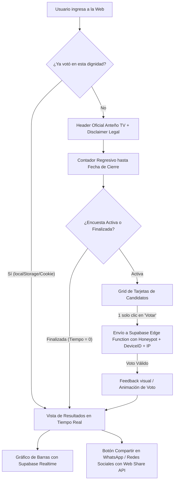

# Plan de Implementación: Sistema de Encuestas Anteño TV (Elecciones 2026)

Construcción de una aplicación web moderna, ágil y de alto impacto visual (SPA en una sola pantalla) para encuestas electorales no oficiales de **Anteño TV**, enfocada en las elecciones seccionales de Ecuador 2026 (Alcaldía de Antonio Ante, Imbabura).

---

## 1. Identidad Visual y Branding Extraído

Del análisis exhaustivo del sitio oficial [antenotv.vercel.app](https://antenotv.vercel.app/):
- **Paleta de Colores**:
  - Fondo oscuro / Base: `#0f172a` (Slate 900) y `#020617` (Slate 950) con mallas de gradiente radial azul/cyan.
  - Tarjetas / Glass: `rgba(30, 41, 59, 0.6)` con desenfoque (`backdrop-blur-md`) y bordes sutiles `rgba(255, 255, 255, 0.08)`.
  - Primario: `#3b82f6` (Azul Anteño)
  - Acento: `#06b6d4` (Cyan Eléctrico)
  - Gradiente estelar: `linear-gradient(135deg, #3b82f6 0%, #06b6d4 100%)`
- **Tipografía**: `Outfit` (Google Fonts: 300, 400, 500, 600, 700, 800) para un estilo moderno, legible y limpio.
- **Logotipos y Marcas**:
  - Logo SVG oficial de Anteño TV con su lema *"Desde el Corazón de Imbabura"*.
  - Badge de autoría "Desarrollado por TeoDev" (`@TeoDev1611`).

---

## 2. Flujo de Usuario (Pantalla Única, Cero Recargas)



---

## 3. Arquitectura y Stack Técnico

- **Frontend**: React 18 + Vite + Tailwind CSS / Vanilla CSS moderno.
- **Tipografía & Assets**: Google Font `Outfit`, iconos SVG nativos ultra-ligeros y Lucide Icons.
- **Base de Datos**: Supabase PostgreSQL (Plan Free) con Row Level Security (RLS).
- **Backend Serverless**: Supabase Edge Function (`vote`) con validación de honeypot, hashing criptográfico de IP (SHA-256) y rate limiting (máximo 3 votos por IP / 24h).
- **En Vivo**: Supabase Realtime (`postgres_changes` / canal de difusión) para actualizar porcentajes y votos de los candidatos al instante.
- **Gráficos**: Componente de barras de progreso animadas reactivas con Tailwind/CSS de alta definición (con soporte opcional Recharts/Chart.js sin sobrepeso de bundle).
- **Compartir**: Web Share API nativa con fallback automático a copiado de portapapeles con toast flotante.
- **SEO & Open Graph**: Metadatos dinámicos, `sitemap.xml`, `robots.txt`, preview optimizada para WhatsApp, Twitter/X y Facebook.

---

## 4. Estructura de Datos en Supabase (`schema.sql`)

```sql
-- 1. Cantones
CREATE TABLE cantones (
    id UUID PRIMARY KEY DEFAULT gen_random_uuid(),
    nombre TEXT NOT NULL,
    activo BOOLEAN DEFAULT true,
    created_at TIMESTAMPTZ DEFAULT now()
);

-- 2. Dignidades (Alcaldía, Concejales, Prefectura, etc.)
CREATE TABLE dignidades (
    id UUID PRIMARY KEY DEFAULT gen_random_uuid(),
    nombre TEXT NOT NULL,
    nivel TEXT NOT NULL CHECK (nivel IN ('cantonal', 'provincial')),
    activa BOOLEAN DEFAULT true,
    fecha_cierre TIMESTAMPTZ NOT NULL,
    canton_id UUID REFERENCES cantones(id),
    created_at TIMESTAMPTZ DEFAULT now()
);

-- 3. Candidatos
CREATE TABLE candidatos (
    id UUID PRIMARY KEY DEFAULT gen_random_uuid(),
    dignidad_id UUID NOT NULL REFERENCES dignidades(id) ON DELETE CASCADE,
    canton_id UUID REFERENCES cantones(id),
    nombre TEXT NOT NULL,
    foto_url TEXT,
    movimiento TEXT NOT NULL,
    lista_numero TEXT,
    orden INT DEFAULT 0,
    color_hex TEXT DEFAULT '#3b82f6',
    created_at TIMESTAMPTZ DEFAULT now()
);

-- 4. Votos (Protegido por RLS, insertado por Edge Function)
CREATE TABLE votos (
    id UUID PRIMARY KEY DEFAULT gen_random_uuid(),
    candidato_id UUID NOT NULL REFERENCES candidatos(id) ON DELETE CASCADE,
    dignidad_id UUID NOT NULL REFERENCES dignidades(id) ON DELETE CASCADE,
    ip_hash TEXT NOT NULL,
    device_id TEXT NOT NULL,
    created_at TIMESTAMPTZ DEFAULT now()
);

-- 5. Vista agregada para resultados en vivo (sin exponer IPs ni device_ids)
CREATE OR REPLACE VIEW vista_resultados_candidatos AS
SELECT 
    c.id AS candidato_id,
    c.dignidad_id,
    c.nombre,
    c.foto_url,
    c.movimiento,
    c.lista_numero,
    c.color_hex,
    c.orden,
    COUNT(v.id) AS total_votos
FROM candidatos c
LEFT JOIN votos v ON v.candidato_id = c.id
GROUP BY c.id;
```

---

## 5. Medidas de Seguridad y Anti-Spam en Servidor

1. **Honeypot Oculto**: Campo invisible para humanos en el formulario (`website_url` o `phone_check`). Si contiene algún valor, la Edge Function rechaza la solicitud silenciosamente.
2. **Device ID & LocalStorage**: Identificador único persistido en `localStorage` y cookie segura.
3. **IP Hashing & Rate Limiting**: La Edge Function obtiene la IP del encabezado `x-forwarded-for`, aplica `SHA-256(ip + SALT_SECRETO)` y valida que no exceda 3 votos en 24 horas por dignidad (permitiendo que varios miembros de una familia o red compartida voten legítimamente sin permitir bots).
4. **Punto de integración para hCaptcha**: Cabecera y parámetro opcional `captcha_token` preparado en la Edge Function para habilitación futura sin reestructuración.

---

## 6. Archivos y Estructura del Proyecto

```
c:/Users/Mateo/Desktop/Encuestas/
├── public/
│   ├── favicon.ico
│   ├── og-image.jpg (Generado con branding de Anteño TV)
│   ├── robots.txt
│   └── sitemap.xml
├── src/
│   ├── assets/
│   │   ├── logo-anteno.svg
│   │   └── candidatos/
│   ├── components/
│   │   ├── Header.jsx (Logos Anteño TV y TeoDev)
│   │   ├── Disclaimer.jsx (Advertencia legal no oficial CNE)
│   │   ├── CountdownTimer.jsx (Contador regresivo dinámico)
│   │   ├── CandidateCard.jsx (Tarjeta de candidato con botón de 1 toque)
│   │   ├── CandidateGrid.jsx (Grid mobile-first)
│   │   ├── LiveResultsChart.jsx (Gráfico de barras y % en tiempo real)
│   │   ├── ShareButton.jsx (Web Share API + WhatsApp + Copy)
│   │   └── ConfettiFeedback.jsx (Animación de confirmación)
│   ├── hooks/
│   │   ├── useActiveSurvey.js (Carga de datos Supabase)
│   │   ├── useRealtimeVotes.js (Suscripción en vivo)
│   │   └── useVoteSubmission.js (Lógica de voto + Edge Function + anti-spam)
│   ├── lib/
│   │   ├── supabase.js (Cliente Supabase)
│   │   ├── storage.js (Control de votos en localStorage)
│   │   └── antiSpam.js (Generador de device_id y honeypot)
│   ├── App.jsx (Flujo unificado en pantalla única)
│   ├── main.jsx
│   └── index.css (Estilos Outfit, Glassmorphism, Tailwind)
├── supabase/
│   ├── functions/
│   │   └── vote/
│   │       └── index.ts (Edge Function Deno/TypeScript)
│   └── schema.sql (Migración completa con RLS, RPC y datos de prueba)
├── .env.example
├── README.md (Guía completa de instalación, Supabase, Vercel/Netlify)
├── package.json
├── tailwind.config.js
└── vite.config.js
```

---

## 7. Plan de Verificación

### Pruebas Funcionales y Manuales
1. **Flujo de Votación**:
   - Votar por un candidato -> verificar feedback visual inmediato.
   - Verificar que la vista cambie instantáneamente a los resultados en vivo.
   - Probar botón "Compartir" en navegadores móviles (Web Share) y desktop (Copiado de texto listo para WhatsApp).
2. **Anti-Duplicación**:
   - Recargar la página -> comprobar que el usuario sigue viendo los resultados y no el formulario.
   - Probar intento de voto con honeypot manipulado -> verificar rechazo en servidor.
3. **Contador Regresivo**:
   - Probar con fecha de cierre futura -> contador activo, botones habilitados.
   - Probar con fecha de cierre expirada -> mensaje "Esta encuesta ha finalizado" y visualización directa de resultados finales.
4. **Tiempo Real**:
   - Abrir dos pestañas/dispositivos -> emitir voto en una -> verificar actualización instantánea de barras y porcentajes en la otra sin recargar.
5. **Responsividad & Branding**:
   - Validar en viewport móvil (360px - 414px) y desktop (> 1024px).
   - Comprobar que no haya scroll horizontal ni elementos desalineados.

---

> [!IMPORTANT]
> El diseño se basará estrictamente en la estética premium de **Anteño TV** (`#0f172a`, gradientes Azul-Cyan, tipografía `Outfit`, efectos de cristal y microanimaciones), listo para ser desplegado en **Vercel** o **Netlify** con **Supabase**.
